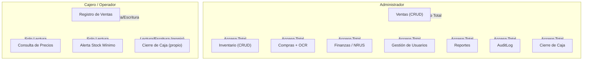
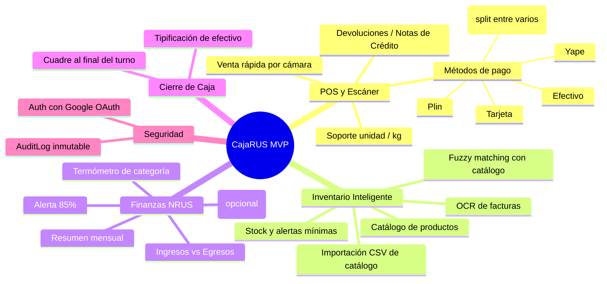

# Visión y PRD — CajaRUS

## Visión del Producto

Crear una aplicación web móvil que actúe como el centro operativo y financiero para bodegas minoristas, permitiendo la digitalización de inventarios, ventas rápidas y control del régimen NRUS sin fricción tecnológica para usuarios no nativos digitales.

## Problema

Tiendas de abarrotes en Perú operan sin sistemas digitales. El control de inventario, precios, ventas y finanzas se lleva manualmente, generando descuadres de caja, estrés falta de organización y pérdida de tiempo y gestión en tareas administrativas.

## Usuarios Target

| Usuario | Perfil | Necesidad |
|---|---|---|
| Dueñ@ (Administrador(a)) | Gestiona compras, finanzas, proveedores | Control total del negocio, alertas NRUS, carga de facturas |
| Cajero/Operador | Atiende clientes, registro de ventas | POS rápido, consulta de precios, alertas de stock |
| Tú (Soporte Técnico) | Configuración y mantenimiento | Gestión de usuarios, reportes, supervisión |

## Stack Tecnológico Validado

- Next.js App Router con Server Components y Server Actions
- Prisma ORM sobre Neon (PostgreSQL Serverless)
- Cloudflare R2 para almacenamiento de imágenes
- Vercel AI SDK + Google Gemini para OCR de facturas
- PWA con `@ducanh2912/next-pwa`
- Estado offline con Zustand + localStorage
- Escáner de barras con `BarcodeDetector` API + fallback `html5-qrcode`
- **Auth con Google OAuth** (NextAuth.js / Auth.js)
- **AuditLog** — registro inmutable de acciones críticas (ventas, anulaciones, cambios de inventario, inicios de sesión)

## Roles y Permisos (RBAC)

## Módulos Esenciales del MVP

### Módulo 1: Punto de Venta (POS) y Escáner

- Venta rápida mediante cámara del celular (`BarcodeDetector` / `html5-qrcode`)
- Soporte para productos fraccionados (KG) con teclado numérico
- **Múltiples métodos de pago por venta (MIXED):** dividir el total entre efectivo, Yape, Plin y/o tarjeta en una misma transacción
- Cálculo de precio proporcional en tiempo real
- Botón gigante "Cobrar" con selección de método de pago
- **Devoluciones / Notas de Crédito:** reversión de una venta con ajuste automático de stock y reversión del monto del NRUS

### Módulo 2: Inventario Inteligente y Compras

- Catálogo con costo de compra, precio de venta, stock actual y stock mínimo
- **Importación CSV de catálogo** para carga masiva inicial
- Integración de facturas OCR: foto → IA extrae RUC, fecha, productos, montos
- Fuzzy matching contra catálogo existente en PostgreSQL
- Confirmación humana antes de guardar

### Módulo 3: Finanzas y Alertas NRUS (SUNAT)

- Registro centralizado de ingresos (ventas) y egresos (compras)
- **Gastos Operativos opcionales:** alquiler, luz, sueldos — no requieren monto obligatorio, si el usuario no los registra se asume 0
- Control de categorías del Nuevo RUS

  | Categoría | Cuota Mensual | Límite Ingresos Brutos Mensuales |
  |---|---|---|
  | Categoría 1 | S/ 20 | Hasta S/ 5,000 |
  | Categoría 2 | S/ 50 | Hasta S/ 8,000 |

- Alerta al 85% del límite (S/ 4,250 para Categoría 1)
- Alerta crítica al acercarse a S/ 8,000 (transición a Categoría 2)
- **Regla de exclusión:** si el usuario excede el límite de su categoría por **2 meses consecutivos**, el sistema sugiere migrar de categoría y muestra advertencia persistente
- **NRUS solo emite boletas,** no facturas. La app no debe ofrecer emisión de facturas para contribuyentes NRUS.

### Módulo 4: Cierre de Caja

- Tipificación de efectivo al iniciar turno (monto inicial en caja)
- Registro de ingresos/egresos durante el turno
- Cuadre al final del turno: efectivo declarado vs efectivo esperado (ventas en efectivo + apertura - retiros)
- Diferencias se registran como sobrante o faltante
- Histórico de cierres por usuario

### Módulo 5: Seguridad y Auditoría

- **Auth con Google OAuth** mediante NextAuth.js / Auth.js
- **AuditLog:** registro inmutable con timestamp, usuario, acción, detalle y dirección IP para toda operación crítica (venta, anulación, modificación de inventario, cierre de caja, cambios de roles)

## Roadmap MVP

1. Inicialización del proyecto y configuración de base de datos
2. Sistema de autenticación con Google OAuth + roles
3. Importación CSV de catálogo de productos
4. Módulo POS (escáner + carrito + cobro con MIXED)
5. Módulo de inventario (CRUD + alertas)
6. Módulo de compras con OCR
7. Dashboard financiero y control NRUS (con gastos operativos opcionales)
8. Módulo de devoluciones / Notas de Crédito
9. Cierre de Caja
10. AuditLog
11. PWA y sincronización offline

## Post-MVP (v2)

- **Fiados/Crédito:** registro de ventas al crédito, control de cobranza, saldo pendiente por cliente
- **Widget de resumen en homescreen:** accesos directos a las funciones más usadas
- **Notificaciones push** para alertas de stock, vencimiento de productos, tope NRUS
- **Reportes exportables** (PDF/Excel) de ventas, compras, rentabilidad y NRUS
- **Asistente de voz IA:** "Añade medio kilo de azúcar y un tarro de leche grande" — comandos por voz al POS
