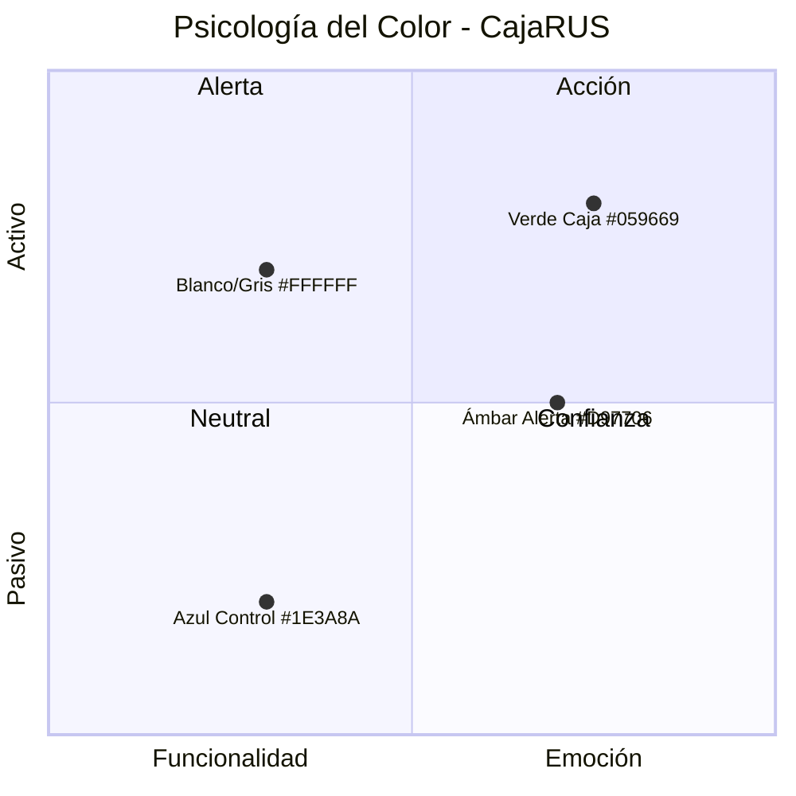

# Brandboard — CajaRUS

**Esencia de Marca:** El control de tu negocio, al toque.

CajaRUS no busca ser un software corporativo frío. Es una herramienta aliada, cercana y clara, diseñada para que los bodegueros peruanos sientan orgullo y tranquilidad al ver crecer su negocio de forma segura, escalable y entendible.

## 1. Paleta de Colores

| Color | Hexadecimal | Aplicación UI | Significado |
|---|---|---|---|
| Verde Caja | `#059669` (Emerald 600) | Botón "Cobrar", ingresos, stock disponible | Dinero, éxito, acción positiva |
| Azul Control | `#1E3A8A` (Blue 900) | Barras de navegación, encabezados | Confianza, orden, estabilidad |
| Ámbar Alerta | `#D97706` (Amber 600) | Stock bajo, alerta NRUS 85% | Prevención, atención |
| Blanco | `#FFFFFF` | Fondos de pantalla | Limpieza visual |
| Gris | `#F3F4F6` | Fondos de tarjetas (cards) | Descanso visual |

## 2. Tipografía

| Uso | Fuente | Peso | Tamaño |
|---|---|---|---|
| Títulos y Precios | System Sans-Serif (Inter / Roboto / SF Pro) | Bold (700) | 24-32px |
| Totales y montos grandes | System Sans-Serif | Bold (700) | **24px+** |
| Textos y Descripciones | System Sans-Serif | Regular (400) | **18px mínimo** |
| Texto grande (accesibilidad) | System Sans-Serif | Regular (400) | **24px** (toggles en settings) |

No se cargan fuentes externas para optimizar rendimiento en dispositivos de gama baja.

## 3. Estilo Visual

- **Diseño Card-Based:** Información agrupada en tarjetas blancas sobre fondo gris claro
- **Botones XXL:** Altura mínima 56px para uso con una sola mano
- **Bottom Navigation:** barra inferior fija con ícono + texto, en lugar de menú hamburguesa. Las secciones principales estarán siempre visibles y accesibles con el pulgar.
  - Carrito → Ventas
  - Caja → Inventario
  - Billete → Finanzas
  - Gráfico → NRUS
  - Ajustes → Configuración
- **Alto contraste:** el diseño debe garantizar una relación de contraste mínima de 4.5:1 para texto normal y 3:1 para texto grande, validado para uso en bodega con luz solar directa. El verde `#059669` y el azul `#1E3A8A` deben cumplir este ratio sobre fondo blanco.
- **Iconografía Simple:** Trazo grueso (Heroicons / Lucide)

## 4. Voz y Tono

| Principio | Ejemplo |
|---|---|
| Cercana pero Respetuosa | "¡Buen margen! Estás ganando X por este producto" |
| Directa al Grano | "Escanea el producto" → "Elige método de pago" → "Venta guardada" |
| Visualmente Alentadora | "¡Mes cerrado con éxito! Tu cuota es de S/ 20" |

### 4.1 Mensajes de Error en Español Peruano Coloquial

Los mensajes de error deben evitar tecnicismos y usar un tono cercano y claro, propio del habla cotidiana peruana.

| Contexto | Mensaje técnico (evitar) | Mensaje coloquial (usar) |
|---|---|---|
| Error de conexión | "Network request failed" | "Sin señal. Revisa tu internet y vuelve a intentar" |
| Error al escanear | "Barcode detection failed" | "No se pudo leer el código. Acerca bien la cámara al código de barras" |
| Producto no encontrado | "Product not found" | "Este producto no está en tu catálogo. ¿Quieres registrarlo?" |
| Error al guardar venta | "Transaction commit failed" | "Ocurrió un problema al guardar la venta. Intenta de nuevo" |
| Stock insuficiente | "Insufficient stock" | "Solo tienes X unidades. Registra una cantidad menor o haz un pedido" |
| Tope NRUS excedido | "Tax category limit exceeded" | "Casi llegas al tope del NRUS. Conversa con tu contador para ver si subes de categoría" |
| Error de autenticación | "Invalid credentials" | "Correo o contraseña incorrectos. Vuelve a intentar" |
| Error de cierre de caja | "Cash register reconciliation failed" | "Hay un descuadre en la caja. Revisa el efectivo antes de cerrar" |
| Error genérico | "Internal server error" | "Algo salió mal. Ya estamos trabajando para arreglarlo" |
| Confirmación de anulación | N/A | "¿Seguro que quieres anular esta venta? Esta acción no se puede deshacer" |
