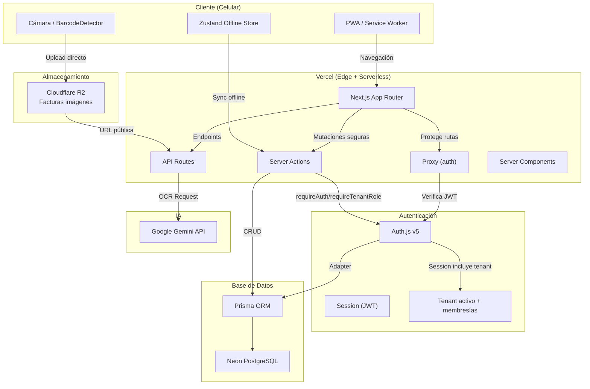
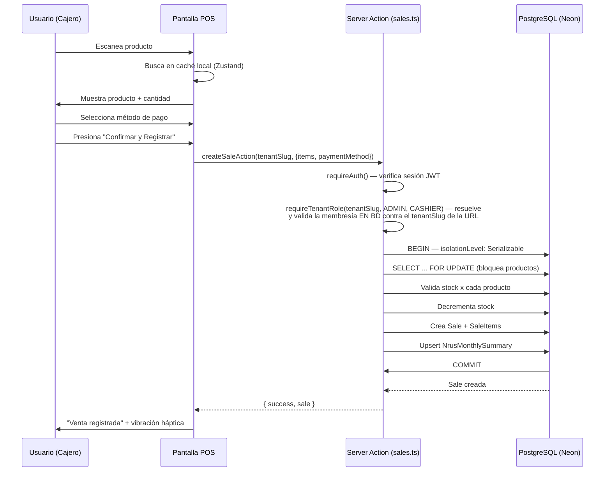

# Arquitectura del Sistema — CajaRUS

## Diagrama de Arquitectura



## Estructura de Directorios

```
cajarus/
├── src/
│   ├── app/
│   │   ├── layout.tsx               # SessionProvider + Providers (PWA, OfflineSync, Tema)
│   │   ├── page.tsx                  # Redirección según sesión (tenants / login)
│   │   ├── tenants/                  # Selector de bodegas
│   │   ├── login/
│   │   │   └── page.tsx              # Inicio de sesión
│   │   ├── pos/
│   │   │   └── page.tsx              # Alias legacy: redirige a la bodega primaria
│   │   ├── t/
│   │   │   └── [tenantSlug]/
│   │   │       ├── page.tsx          # Landing de bodega: redirige a .../pos
│   │   │       └── pos/page.tsx      # POS por bodega
│   │   ├── inventory/
│   │   │   ├── page.tsx              # Lista + buscador predictivo
│   │   │   └── [id]/page.tsx         # Edición de producto
│   │   ├── purchases/
│   │   │   ├── page.tsx              # Historial de compras
│   │   │   ├── upload/               # Subida de factura + OCR
│   │   │   └── new/page.tsx          # Formulario manual / confirmación OCR
│   │   └── dashboard/
│   │       └── page.tsx              # Finanzas + termómetro NRUS
│   ├── actions/                      # Server Actions
│   │   ├── auth.ts
│   │   ├── sales.ts                  # Transacciones + NRUS sync
│   │   ├── products.ts               # CRUD productos
│   │   └── purchases.ts              # Compras + OCR IA
│   ├── components/
│   │   ├── ui/                       # Botones XXL, cards, inputs
│   │   └── barcode-scanner.tsx       # Escáner con fallback
│   ├── generated/
│   │   └── prisma/                   # Prisma Client generado (output)
│   ├── lib/
│   │   ├── auth.ts                   # Configuración Auth.js v5
│   │   ├── auth-helpers.ts           # requireAuth(), requireTenantRole()
│   │   ├── tenancy.ts                # Tenant hub, memberships, slug helpers
│   │   ├── prisma.ts                 # Singleton Prisma (PrismaPg adapter)
│   │   ├── r2.ts                     # S3 Client para Cloudflare R2
│   │   ├── ai.ts                     # Vercel AI SDK (Gemini)
│   │   └── env.ts                    # Validación de variables de entorno
│   ├── services/                     # Lógica de negocio (patrón recomendado)
│   ├── repositories/                 # Acceso a datos abstracto (patrón recomendado)
│   ├── store/
│   │   └── useOfflineStore.ts        # Zustand persistente
│   ├── types/
│   │   └── next-auth.d.ts            # Tipos extendidos de Session + JWT
│   ├── proxy.ts                      # Auth.js proxy (reemplaza middleware.ts)
├── prisma/
│   ├── schema.prisma                 # Modelo de datos (Prisma 7)
├── prisma.config.ts                  # Configuración CLI Prisma 7
├── public/
│   └── manifest.json                 # PWA manifest
└── prisma/
    └── schema.prisma                 # Modelo de datos
```

## Server Actions Clave

### Flujo de Venta Express



## Principios de Arquitectura

1. **Server Components por defecto**: Mínimo JS en cliente. Las rutas POST y mutaciones se manejan exclusivamente desde Server Components y Server Actions.
2. **Client Components aislados**: Solo escáner, carrito, y teclado numérico son interactivos.
3. **Server Actions para mutaciones**: Toda mutación pasa por una Server Action que verifica autenticación (`requireAuth`) y autorización por bodega (`requireTenantRole(tenantSlug, ...rol)`) antes de ejecutarse. `tenantSlug` **siempre** debe venir explícito de la URL (`/t/[tenantSlug]/...`) que el Server Component ya validó — nunca del "tenant primario" cacheado en el JWT (ver punto 4). Si una Server Action confiara en el tenant primario del JWT, un usuario con más de una bodega podría escribir en la bodega equivocada solo por tener otra pestaña abierta.
4. **Auth.js v5 como gateway, pero con dos responsabilidades distintas**: el Proxy (`src/proxy.ts`) protege rutas completas y hace *routing gating* (ej. rutas admin-only bajo `/t/[tenantSlug]/<segmento>`) usando el tenant que aparece en la URL; `requireTenantRole()` en Server Actions/Route Handlers hace la *autorización real de la mutación* y siempre revalida la membresía contra la BD (no contra el JWT cacheado hasta 5 min), porque ahí la ventana de "sesión zombie" no es aceptable. Ambas capas comparten el mismo JWT, pero ninguna delega en la otra para la decisión final de "a qué tenant pertenece esta escritura".
5. **Offline-First**: Zustand persiste en localStorage, cola de sincronización.
6. **Edge Runtime para OCR**: Procesamiento de imágenes en Vercel Edge.
7. **Transacciones serializables**: Las operaciones de venta usan `isolationLevel: Serializable` con `SELECT FOR UPDATE` para evitar condiciones de carrera sobre el stock.
8. **Prisma 7 Adapter Pattern**: El cliente Prisma usa `@prisma/adapter-pg` con `pg.Pool` en lugar de conexión directa por URL. Ver `src/lib/prisma.ts`.
9. **Proxy en lugar de Middleware**: Next.js 16 cambió el contrato de Middleware. Ahora se usa `src/proxy.ts` que exporta `{auth, signIn, signOut}` para compatibilidad con Auth.js v5. El gating por rol (`roleRouteMap`) matchea contra el primer segmento **dentro** de `/t/[tenantSlug]/...` (ej. `dashboard`, `purchases`, `admin`), no contra rutas top-level — esas ya no reflejan la arquitectura real.
10. **Índices compuestos**: Las tablas operativas usan índices compuestos con `tenantId` primero para aislar consultas y mantener rendimiento por bodega.
11. **Integridad referencial por tenant a nivel de BD**: no basta con que cada tabla tenga su propio `tenantId` — las FKs entre tablas hijas y sus padres (ej. `SaleItem` → `Sale`/`Product`) son compuestas `(tenantId, id)`, y las relaciones "quién hizo esto" (`Sale.cashierId`, `Purchase.adminId`, etc.) tienen además una FK compuesta hacia `TenantMember` agregada a mano en la migración SQL. Esto convierte un bug de aplicación que mezclaría datos entre bodegas en un error de base de datos, no en una fuga silenciosa. Ver `docs/04-schema.md` para el detalle.
