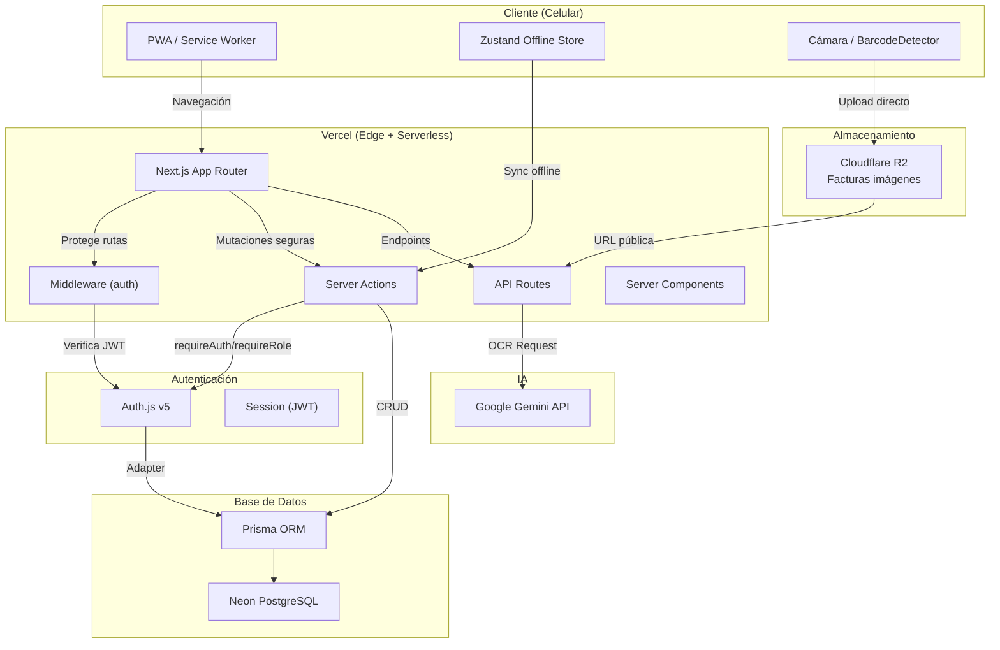
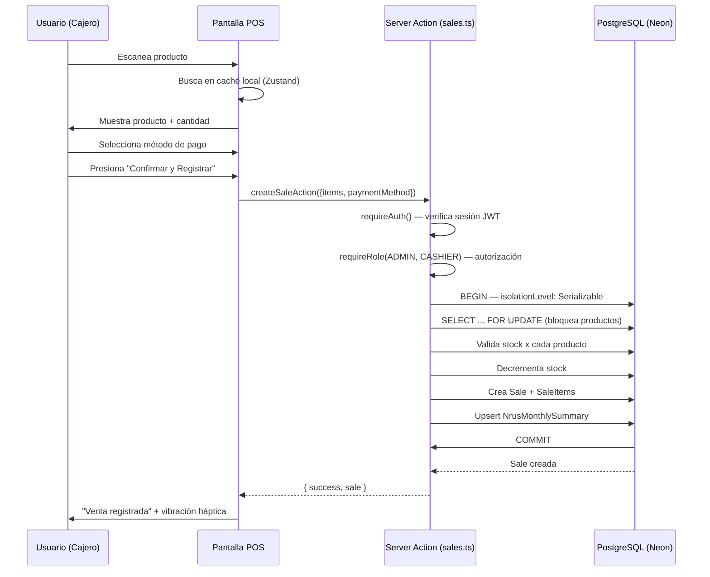

# Arquitectura del Sistema — CajaRUS

## Diagrama de Arquitectura



## Estructura de Directorios

```
cajarus/
├── src/
│   ├── app/
│   │   ├── layout.tsx               # SessionProvider + Providers (PWA, OfflineSync, Tema)
│   │   ├── page.tsx                  # Redirección según sesión (POS / Dashboard)
│   │   ├── login/
│   │   │   └── page.tsx              # Inicio de sesión
│   │   ├── pos/
│   │   │   ├── page.tsx              # POS Server Component (protegido)
│   │   │   └── client-pos.tsx        # Cliente: cámara, carrito, teclado
│   │   ├── inventory/
│   │   │   ├── page.tsx              # Lista + buscador predictivo
│   │   │   └── [id]/page.tsx         # Edición de producto
│   │   ├── purchases/
│   │   │   ├── page.tsx              # Historial de compras
│   │   │   ├── upload/               # Subida de factura + OCR
│   │   │   └── new/page.tsx          # Formulario manual / confirmación OCR
│   │   └── dashboard/
│   │       └── page.tsx              # Finanzas + termómetro NRUS
│   ├── actions/                      # Server Actions
│   │   ├── auth.ts
│   │   ├── sales.ts                  # Transacciones + NRUS sync
│   │   ├── products.ts               # CRUD productos
│   │   └── purchases.ts              # Compras + OCR IA
│   ├── components/
│   │   ├── ui/                       # Botones XXL, cards, inputs
│   │   └── barcode-scanner.tsx       # Escáner con fallback
│   ├── lib/
│   │   ├── auth.ts                   # Configuración Auth.js v5
│   │   ├── auth-helpers.ts           # requireAuth(), requireRole()
│   │   ├── prisma.ts                 # Singleton Prisma
│   │   ├── r2.ts                     # S3 Client para Cloudflare R2
│   │   ├── ai.ts                     # Vercel AI SDK (Gemini)
│   │   └── env.ts                    # Validación de variables de entorno
│   ├── services/                     # Lógica de negocio (patrón recomendado)
│   ├── repositories/                 # Acceso a datos abstracto (patrón recomendado)
│   ├── store/
│   │   └── useOfflineStore.ts        # Zustand persistente
│   ├── types/
│   │   └── next-auth.d.ts            # Tipos extendidos de Session + JWT
│   └── middleware.ts                 # Protección de rutas + verificación de rol
├── public/
│   └── manifest.json                 # PWA manifest
└── prisma/
    └── schema.prisma                 # Modelo de datos
```

## Server Actions Clave

### Flujo de Venta Express



## Principios de Arquitectura

1. **Server Components por defecto**: Mínimo JS en cliente. Las rutas POST y mutaciones se manejan exclusivamente desde Server Components y Server Actions.
2. **Client Components aislados**: Solo escáner, carrito, y teclado numérico son interactivos.
3. **Server Actions para mutaciones**: Toda mutación pasa por una Server Action que verifica autenticación (`requireAuth`) y autorización (`requireRole`) antes de ejecutarse.
4. **Auth.js v5 como gateway**: Middleware protege rutas completas; Server Actions verifican sesión internamente; ambas capas usan el mismo JWT.
5. **Offline-First**: Zustand persiste en localStorage, cola de sincronización.
6. **Edge Runtime para OCR**: Procesamiento de imágenes en Vercel Edge.
7. **Transacciones serializables**: Las operaciones de venta usan `isolationLevel: Serializable` con `SELECT FOR UPDATE` para evitar condiciones de carrera sobre el stock.
8. **Índices compuestos**: Sale`[cashierId, saleDate]`, SaleItem`[productId]`, Purchase`[adminId, purchaseDate]` para consultas frecuentes de reportes y búsquedas.
