# Modelo de Datos — CajaRUS

## Diagrama Entidad-Relación

```mermaid
erDiagram
    User ||--o{ Account : "tiene"
    User ||--o{ Session : "tiene"
    Tenant ||--o{ TenantMember : "tiene"
    Tenant ||--o{ Category : "clasifica"
    Tenant ||--o{ Product : "contiene"
    Tenant ||--o{ Sale : "registra"
    Tenant ||--o{ Purchase : "administra"
    Tenant ||--o{ Expense : "registra"
    Tenant ||--o{ CashClosure : "realiza"
    Tenant ||--o{ NrusMonthlySummary : "resume"
    Tenant ||--o{ AuditLog : "genera"
    Tenant ||--o{ WasteAdjustment : "registra"
    Tenant ||--o{ NrusPayment : "cobra"
    Tenant ||--o{ SaleReturn : "registra"
    User ||--o{ TenantMember : "pertenece a"
    User ||--o{ Sale : "cajero"
    User ||--o{ Purchase : "administra"
    User ||--o{ Expense : "registra"
    User ||--o{ CashClosure : "realiza"
    User ||--o{ AuditLog : "genera"
    User ||--o{ WasteAdjustment : "registra"
    User ||--o{ SaleReturn : "procesa"
    Sale ||--|{ SaleItem : "contiene"
    Sale ||--o{ SaleReturn : "devuelta en"
    Category ||--o{ Product : "clasifica"
    Product ||--o{ SaleItem : "vendido en"
    Product ||--o{ PurchaseItem : "comprado en"
    Product ||--o{ WasteAdjustment : "ajustado por"
    Purchase ||--|{ PurchaseItem : "contiene"
    NrusMonthlySummary ||--o{ NrusPayment : "genera"
    SaleReturn ||--|{ SaleReturnItem : "contiene"
    SaleItem ||--o{ SaleReturnItem : "devuelto en"

    Tenant {
        uuid id PK
        varchar name
        varchar slug UK
        boolean is_active
        datetime created_at
        datetime updated_at
    }

    TenantMember {
        uuid id PK
        uuid tenant_id FK
        uuid user_id FK
        enum role
        boolean is_primary
        boolean is_active
        datetime created_at
        datetime updated_at
    }

    Account {
        uuid id PK
        uuid user_id FK
        varchar type
        varchar provider
        varchar provider_account_id UK
        text refresh_token "nullable"
        text access_token "nullable"
        int expires_at "nullable"
    }

    Session {
        uuid id PK
        varchar session_token UK
        uuid user_id FK
        datetime expires
    }

    User {
        uuid id PK
        varchar name
        varchar email UK
        datetime email_verified "nullable"
        varchar image "nullable"
        varchar password_hash "nullable"
        boolean is_active
        datetime created_at
        datetime updated_at
    }

    Category {
        uuid id PK
        uuid tenant_id FK
        varchar name UK
    }

    Product {
        uuid id PK
        uuid tenant_id FK
        varchar barcode "nullable"
        varchar name
        text description "nullable"
        uuid category_id FK "nullable"
        decimal cost_price "12,4"
        decimal selling_price "12,4"
        enum unit_type "UNIT | KILOGRAM"
        decimal stock "3 decimales"
        decimal min_stock
        varchar image_url "nullable"
        boolean is_active
        datetime created_at
        datetime updated_at
    }

    Sale {
        uuid id PK
        uuid tenant_id FK
        uuid cashier_id FK
        decimal total_amount
        enum payment_method "CASH | YAPE | PLIN | CARD | MIXED"
        enum status "COMPLETED | CANCELLED | REFUNDED"
        datetime sale_date
        datetime cancelled_at "nullable"
        varchar cancel_reason "nullable"
    }

    SaleItem {
        uuid id PK
        uuid tenant_id FK
        uuid sale_id FK
        uuid product_id FK
        decimal quantity "3 decimales"
        decimal unit_price
        decimal total_price
    }

    Purchase {
        uuid id PK
        uuid tenant_id FK
        uuid admin_id FK
        char supplier_ruc "nullable"
        varchar supplier_name "nullable"
        varchar invoice_number "nullable"
        decimal total_amount
        decimal base_amount "nullable"
        decimal igv_amount "nullable"
        varchar invoice_image_url "nullable"
        datetime purchase_date
        enum status "PENDING | CONFIRMED | CANCELLED"
        json ocr_raw_data "nullable"
        datetime created_at
    }

    PurchaseItem {
        uuid id PK
        uuid tenant_id FK
        uuid purchase_id FK
        uuid product_id FK
        decimal quantity
        decimal unit_cost
        decimal total_cost
    }

    Expense {
        uuid id PK
        uuid tenant_id FK
        uuid admin_id FK
        varchar description
        decimal amount
        varchar category
        datetime expense_date
        datetime created_at
    }

    CashClosure {
        uuid id PK
        uuid tenant_id FK
        uuid cashier_id FK
        decimal expected_amount
        decimal counted_amount
        decimal difference
        datetime closed_at
        text notes "nullable"
    }

    NrusMonthlySummary {
        uuid id PK
        uuid tenant_id FK
        int year
        int month
        decimal total_sales
        decimal total_purchases
        int current_category
        int consecutive_excess
        datetime created_at
        datetime updated_at
    }

    NrusPayment {
        uuid id PK
        uuid tenant_id FK
        uuid summary_id FK
        decimal amount
        date due_date
        datetime paid_at "nullable"
        decimal late_fee "nullable"
        enum status "PENDING | PAID_ON_TIME | PAID_LATE | OVERDUE"
        datetime created_at
    }

    AuditLog {
        uuid id PK
        uuid tenant_id FK
        uuid user_id FK
        varchar action
        varchar entity
        uuid entity_id
        json metadata "nullable"
        datetime created_at
    }

    WasteAdjustment {
        uuid id PK
        uuid tenant_id FK
        uuid product_id FK
        uuid admin_id FK
        decimal quantity "3 decimales"
        enum reason "EXPIRED | DAMAGED | BROKEN | LOST | STOLEN | OTHER"
        varchar description "nullable"
        datetime adjusted_at
        datetime created_at
    }

    SaleReturn {
        uuid id PK
        uuid tenant_id FK
        uuid sale_id FK
        uuid processed_by_id FK
        enum reason "DEFECTIVE | WRONG_ITEM | CUSTOMER_CHANGED_MIND | OTHER"
        decimal total_amount
        varchar notes "nullable"
        datetime returned_at
        datetime created_at
    }

    SaleReturnItem {
        uuid id PK
        uuid tenant_id FK
        uuid return_id FK
        uuid sale_item_id FK
        decimal quantity "3 decimales"
        decimal total_amount
    }
```

## Schema Prisma

El esquema completo vive en `prisma/schema.prisma`. La versión actual es multitenant con una sola BD compartida.

### Modelos clave

| Modelo | Rol |
|---|---|
| `Tenant` | Bodega/negocio aislado |
| `TenantMember` | Membresía y rol por bodega |
| `User` | Identidad global compartida |
| `Category` / `Product` | Catálogo por tenant |
| `Sale` / `SaleItem` | Ventas por tenant |
| `SaleReturn` / `SaleReturnItem` | Devoluciones (parciales) de una venta, por tenant |
| `Purchase` / `PurchaseItem` | Compras por tenant |
| `Expense` / `CashClosure` | Operación por tenant |
| `NrusMonthlySummary` / `NrusPayment` | Control NRUS por tenant |
| `AuditLog` | Trazabilidad por tenant |
| `WasteAdjustment` | Merma/ajuste por tenant |

### Reglas de aislamiento

- Todo dato operativo lleva `tenantId`.
- `User.role` dejó de ser global; el rol vive en `TenantMember.role`.
- Las únicas tablas globales son `User`, `Account`, `Session`, `Tenant` y `TenantMember`.
- Las unicidades críticas ahora son por tenant, por ejemplo `@@unique([tenantId, year, month])` en `NrusMonthlySummary` y `@@unique([tenantId, barcode])` en `Product`.
- **Integridad referencial compuesta (nivel BD, no solo aplicación)**: `Product`, `Sale`, `Purchase`, `SaleItem`, `NrusMonthlySummary` y `SaleReturn` tienen un `@@unique([tenantId, id])` que sirve de target para FKs compuestas desde sus tablas hijas (ej. `SaleItem` referencia a `Sale` y a `Product` vía `(tenantId, saleId) → sales(tenantId, id)` y `(tenantId, productId) → products(tenantId, id)`, no solo por `id`). Esto hace imposible, a nivel de base de datos, que un ítem de venta/compra/merma/devolución apunte a una venta/compra/producto de **otra** bodega — antes solo dependía de que el código de aplicación nunca se equivocara.
- **FKs de "membership" (agregadas a mano en la migración SQL, no representables como relación Prisma sin duplicar el modelo)**: `Sale.cashierId`, `Purchase.adminId`, `Expense.adminId`, `CashClosure.cashierId`, `WasteAdjustment.adminId`, `AuditLog.userId` y `SaleReturn.processedById` tienen, además de su FK simple a `User`, una FK compuesta `(tenantId, <campo>) → tenant_members(tenantId, userId)`. Esto garantiza que quien vendió/compró/ajustó/auditó una fila fue (o fue alguna vez) miembro real de esa bodega — no solo "cualquier usuario válido del sistema". Es defensa en profundidad: el control principal sigue siendo que cada Server Action llame a `requireTenantRole(tenantSlug, ...)` antes de escribir.
- **Índice único parcial** `tenant_members_one_primary_per_user` (`WHERE is_primary = true`, agregado a mano): garantiza que un usuario nunca tenga más de una bodega marcada como "primaria" simultáneamente. Prisma no soporta índices únicos parciales en su DSL.
- **CHECK constraints** (agregados a mano): `products.stock >= 0`, `waste_adjustments.quantity > 0`, `sale_items.quantity > 0`, `purchase_items.quantity > 0`, `sale_return_items.quantity > 0`.
- ⚠️ Todo lo agregado "a mano" arriba (FKs de membership, índice parcial, CHECK) **no está representado en `schema.prisma`** porque el DSL de Prisma no tiene equivalente nativo para estas construcciones sin forzar relaciones fantasma. Si en el futuro se regenera la migración desde cero con `prisma migrate dev`, hay que **volver a agregar ese bloque a mano al final del nuevo `.sql`** — Prisma no lo va a recrear solo, y de hecho `prisma migrate diff` va a reportar las FKs de membership como "drift" porque no existen en el modelo. Ver el comentario correspondiente al final de `prisma/migrations/*/migration.sql`.

## Decisiones de Diseño

1. **Modelo multitenant compartido**: una sola BD y un solo esquema; el aislamiento se garantiza por `tenantId` en cada tabla operativa y por membresía en `TenantMember`.

2. **`User` es global**: identidad compartida entre bodegas. El rol deja de ser global y pasa a `TenantMember.role`.

3. **`Decimal(10,3)` en stock y cantidades**: 3 decimales para precisión en ventas por peso (ej. 0.750 kg). Evita errores de redondeo.

2. **Prisma 7 driver adapter**: El datasource no incluye `url` — esta se configura en `prisma.config.ts` mediante `defineConfig`. En runtime, `PrismaClient` recibe un adapter `PrismaPg(pool)` en `src/lib/prisma.ts`.

3. **`Decimal(12,4)` en precios**: Mayor precisión en costos y precios de venta para operaciones con IGV y descuentos.

4. **`WasteAdjustment` para mermas**: Cada ajuste de inventario por desperdicio, daño, o pérdida queda registrado con `adminId`, `reason`, y `quantity`. Las mermas reducen el stock del producto y son auditables.

6. **`NrusMonthlySummary` como tabla de resumen**: Evita recalcular `SUM` sobre miles de registros cada vez que se abre el dashboard. Se actualiza vía `upsert` en cada venta/compra. Contiene `consecutiveExcess` para detectar meses seguidos sobrecategoría. **Ya no tiene `userId`**: el NRUS es una obligación de la bodega/RUC (el `tenantId`), no de un usuario individual, y el `@@unique` siempre fue `[tenantId, year, month]` sin incluir `userId` — el campo era un resabio del diseño pre-multitenant que no participaba ni en la unicidad ni en ninguna lógica de negocio real.

6. **`ocr_raw_data` como JSON**: Almacena la respuesta cruda de la IA para auditoría y depuración. Permite reconciliar diferencias.

7. **Enums mapeados a `snake_case`**: `user_role`, `unit_type`, `payment_method` en la BD física, pero `UserRole`, `UnitType`, `PaymentMethod` en TypeScript.

8. **`barcode` nullable**: Productos sin código de barras (verduras, pan, granel) pueden existir sin dicho campo.

9. **`passwordHash` nullable**: Usuarios que usan autenticación OAuth (Google) no tienen contraseña local. Solo usuarios creados vía credenciales tradicionales tendrán este campo.

10. **Auth.js v5 con Prisma Adapter**: Las tablas `Account` y `Session` son gestionadas automáticamente por el adaptador de Auth.js. Las sesiones usan estrategia JWT (sin tabla `Session` en ese modo), pero la tabla existe para compatibilidad con base de datos. La sesión transporta el tenant activo y las membresías visibles.

11. **Índices compuestos estratégicos**:
   - `Sale[tenantId, saleDate]` — consultas de reportes por bodega y fecha
   - `SaleItem[tenantId, productId]` — búsquedas de ventas de un producto específico por bodega
   - `Purchase[tenantId, adminId, purchaseDate]` — consultas de compras por administrador y bodega
   - `Product[tenantId, barcode]` — búsqueda rápida de productos por código dentro de la bodega
   - `AuditLog[tenantId, entity, entityId]` — trazabilidad de cambios por entidad y bodega
   - `Expense[tenantId, adminId, expenseDate]` — reportes de gastos

12. **PaymentMethod.MIXED**: Soportar pagos combinados (ej. S/ 5 en efectivo + S/ 10 en YAPE) en una misma venta.

13. **Sale.status y Purchase.status**: Estados para ciclo de vida completo. `Sale.CANCELLED` permite anular ventas sin borrar registros. `Purchase.PENDING` vs `CONFIRMED` permite diferir la confirmación de compras.

14. **AuditLog**: Registro de auditoría centralizado para acciones críticas (anulación de ventas, cambios de precio, ajustes de stock). Cada entrada referencia `userId`, `entity`, `entityId`, y `metadata` JSON con el detalle del cambio.

15. **`SaleReturn` / `SaleReturnItem` para devoluciones parciales**: antes no existía ningún modelo de datos para devoluciones — solo `SaleStatus.REFUNDED` a nivel de venta completa, aunque `docs/05-flows.md` ya describía un flujo `createReturn`. `SaleReturn` permite devolver uno o varios `SaleItem` de una misma `Sale` (no la venta entera), con su propio `reason` (`ReturnReason`) y `processedById`. Igual que `Sale`/`Purchase`, referencia a su venta y a cada `SaleItem` con FKs compuestas por tenant.

16. **Hardening manual de la migración SQL (no expresable en `schema.prisma`)**: Prisma no tiene DSL para CHECK constraints ni índices únicos parciales, así que tres invariantes viven solo en el `.sql` de la migración, agregadas a mano al final: (a) CHECK de cantidades/stock no-negativos, (b) el índice único parcial de `TenantMember.isPrimary`, y (c) las FKs compuestas de "membership" hacia `tenant_members`. Este bloque está claramente delimitado y comentado al final de `prisma/migrations/*/migration.sql` — si se regenera la migración desde cero, hay que volver a copiarlo, porque `prisma migrate dev` no lo va a recrear (y de hecho `prisma migrate diff` reporta las FKs de membership como drift, ya que no existen en el modelo Prisma).
