# Modelo de Datos — CajaRUS

## Diagrama Entidad-Relación

```mermaid
erDiagram
    User ||--o{ Account : "tiene"
    User ||--o{ Session : "tiene"
    User ||--o{ Sale : "registra"
    User ||--o{ Purchase : "administra"
    User ||--o{ Expense : "registra"
    User ||--o{ CashClosure : "realiza"
    User ||--o{ NrusMonthlySummary : "pertenece a"
    User ||--o{ AuditLog : "genera"
    Sale ||--|{ SaleItem : "contiene"
    Category ||--o{ Product : "clasifica"
    Product ||--o{ SaleItem : "vendido en"
    Product ||--o{ PurchaseItem : "comprado en"
    Purchase ||--|{ PurchaseItem : "contiene"
    NrusMonthlySummary ||--o{ NrusPayment : "genera"

    Account {
        uuid id PK
        uuid user_id FK
        varchar type
        varchar provider
        varchar provider_account_id UK
        text refresh_token "nullable"
        text access_token "nullable"
        int expires_at "nullable"
    }

    Session {
        uuid id PK
        varchar session_token UK
        uuid user_id FK
        datetime expires
    }

    User {
        uuid id PK
        varchar name
        varchar email UK
        datetime email_verified "nullable"
        varchar image "nullable"
        varchar password_hash "nullable"
        enum user_role
        boolean is_active
        datetime created_at
        datetime updated_at
    }

    Category {
        uuid id PK
        varchar name UK
    }

    Product {
        uuid id PK
        varchar barcode UK "nullable"
        varchar name
        text description "nullable"
        uuid category_id FK "nullable"
        decimal cost_price "12,4"
        decimal selling_price "12,4"
        enum unit_type "UNIT | KILOGRAM"
        decimal stock "3 decimales"
        decimal min_stock
        varchar image_url "nullable"
        boolean is_active
        datetime created_at
        datetime updated_at
    }

    Sale {
        uuid id PK
        uuid cashier_id FK
        decimal total_amount
        enum payment_method "CASH | YAPE | PLIN | CARD | MIXED"
        enum status "COMPLETED | CANCELLED | REFUNDED"
        datetime sale_date
        datetime cancelled_at "nullable"
        varchar cancel_reason "nullable"
    }

    SaleItem {
        uuid id PK
        uuid sale_id FK
        uuid product_id FK
        decimal quantity "3 decimales"
        decimal unit_price
        decimal total_price
    }

    Purchase {
        uuid id PK
        uuid admin_id FK
        char supplier_ruc "nullable"
        varchar supplier_name "nullable"
        varchar invoice_number "nullable"
        decimal total_amount
        decimal base_amount "nullable"
        decimal igv_amount "nullable"
        varchar invoice_image_url "nullable"
        datetime purchase_date
        enum status "PENDING | CONFIRMED | CANCELLED"
        json ocr_raw_data "nullable"
        datetime created_at
    }

    PurchaseItem {
        uuid id PK
        uuid purchase_id FK
        uuid product_id FK
        decimal quantity
        decimal unit_cost
        decimal total_cost
    }

    Expense {
        uuid id PK
        uuid admin_id FK
        varchar description
        decimal amount
        varchar category
        datetime expense_date
        datetime created_at
    }

    CashClosure {
        uuid id PK
        uuid cashier_id FK
        decimal expected_amount
        decimal counted_amount
        decimal difference
        datetime closed_at
        text notes "nullable"
    }

    NrusMonthlySummary {
        uuid id PK
        uuid user_id FK
        int year
        int month
        decimal total_sales
        decimal total_purchases
        int current_category
        int consecutive_excess
        datetime created_at
        datetime updated_at
    }

    NrusPayment {
        uuid id PK
        uuid summary_id FK
        decimal amount
        date due_date
        datetime paid_at "nullable"
        decimal late_fee "nullable"
        enum status "PENDING | PAID_ON_TIME | PAID_LATE | OVERDUE"
        datetime created_at
    }

    AuditLog {
        uuid id PK
        uuid user_id FK
        varchar action
        varchar entity
        uuid entity_id
        json metadata "nullable"
        datetime created_at
    }
```



## Schema Prisma

```prisma
datasource db {
  provider = "postgresql"
  url      = env("DATABASE_URL")
}

generator client {
  provider = "prisma-client-js"
}

// ──────────────────────────────────────────
// Enums
// ──────────────────────────────────────────

enum UserRole {
  ADMIN
  CASHIER

  @@map("user_role")
}

enum UnitType {
  UNIT
  KILOGRAM

  @@map("unit_type")
}

enum PaymentMethod {
  CASH
  YAPE
  PLIN
  CARD
  MIXED

  @@map("payment_method")
}

enum SaleStatus {
  COMPLETED
  CANCELLED
  REFUNDED

  @@map("sale_status")
}

enum PurchaseStatus {
  PENDING
  CONFIRMED
  CANCELLED

  @@map("purchase_status")
}

enum NrusPaymentStatus {
  PENDING
  PAID_ON_TIME
  PAID_LATE
  OVERDUE

  @@map("nrus_payment_status")
}

// ──────────────────────────────────────────
// Auth (Auth.js)
// ──────────────────────────────────────────

model Account {
  id                String  @id @default(uuid()) @db.Uuid
  userId            String  @map("user_id") @db.Uuid
  type              String  @db.VarChar(50)
  provider          String  @db.VarChar(50)
  providerAccountId String  @map("provider_account_id") @db.VarChar(255)
  refreshToken      String? @map("refresh_token") @db.Text
  accessToken       String? @map("access_token") @db.Text
  expiresAt         Int?    @map("expires_at")

  user User @relation(fields: [userId], references: [id], onDelete: Cascade)

  @@unique([provider, providerAccountId])
  @@map("accounts")
}

model Session {
  id           String   @id @default(uuid()) @db.Uuid
  sessionToken String   @unique @map("session_token") @db.VarChar(255)
  userId       String   @map("user_id") @db.Uuid
  expires      DateTime

  user User @relation(fields: [userId], references: [id], onDelete: Cascade)

  @@map("sessions")
}

// ──────────────────────────────────────────
// Users
// ──────────────────────────────────────────

model User {
  id           String     @id @default(uuid()) @db.Uuid
  name         String     @db.VarChar(100)
  email        String     @unique @db.VarChar(150)
  emailVerified DateTime? @map("email_verified") @db.Timestamptz
  image        String?    @db.VarChar(512)
  passwordHash String?    @map("password_hash") @db.VarChar(255)
  role         UserRole   @default(CASHIER)
  isActive     Boolean    @default(true) @map("is_active")
  createdAt    DateTime   @default(now()) @map("created_at") @db.Timestamptz
  updatedAt    DateTime   @updatedAt @map("updated_at") @db.Timestamptz

  accounts       Account[]
  sessions       Session[]
  sales          Sale[]
  purchases      Purchase[]
  expenses       Expense[]
  cashClosures   CashClosure[]
  nrusSummaries  NrusMonthlySummary[]
  auditLogs      AuditLog[]

  @@map("users")
}

// ──────────────────────────────────────────
// Catalog & Inventory
// ──────────────────────────────────────────

model Category {
  id       String    @id @default(uuid()) @db.Uuid
  name     String    @unique @db.VarChar(100)
  products Product[]

  @@map("categories")
}

model Product {
  id           String         @id @default(uuid()) @db.Uuid
  barcode      String?        @unique @db.VarChar(50)
  name         String         @db.VarChar(150)
  description  String?        @db.Text
  categoryId   String?        @map("category_id") @db.Uuid
  costPrice    Decimal        @map("cost_price") @db.Decimal(12, 4)
  sellingPrice Decimal        @map("selling_price") @db.Decimal(12, 4)
  unitType     UnitType       @default(UNIT) @map("unit_type")
  stock        Decimal        @default(0.000) @db.Decimal(10, 3)
  minStock     Decimal        @default(5.000) @map("min_stock") @db.Decimal(10, 3)
  imageUrl     String?        @map("image_url") @db.VarChar(512)
  isActive     Boolean        @default(true) @map("is_active")
  createdAt    DateTime       @default(now()) @map("created_at") @db.Timestamptz
  updatedAt    DateTime       @updatedAt @map("updated_at") @db.Timestamptz

  category      Category?     @relation(fields: [categoryId], references: [id], onDelete: SetNull)
  saleItems     SaleItem[]
  purchaseItems PurchaseItem[]

  @@index([barcode])
  @@index([name])
  @@index([categoryId])
  @@index([isActive, barcode])
  @@map("products")
}

// ──────────────────────────────────────────
// Sales
// ──────────────────────────────────────────

model Sale {
  id            String        @id @default(uuid()) @db.Uuid
  cashierId     String        @map("cashier_id") @db.Uuid
  totalAmount   Decimal       @map("total_amount") @db.Decimal(10, 2)
  paymentMethod PaymentMethod @default(CASH) @map("payment_method")
  status        SaleStatus    @default(COMPLETED)
  saleDate      DateTime      @default(now()) @map("sale_date") @db.Timestamptz
  cancelledAt   DateTime?     @map("cancelled_at") @db.Timestamptz
  cancelReason  String?       @map("cancel_reason") @db.VarChar(200)

  cashier User     @relation(fields: [cashierId], references: [id], onDelete: Restrict)
  items   SaleItem[]

  @@index([saleDate])
  @@index([cashierId, saleDate])
  @@map("sales")
}

model SaleItem {
  id         String  @id @default(uuid()) @db.Uuid
  saleId     String  @map("sale_id") @db.Uuid
  productId  String  @map("product_id") @db.Uuid
  quantity   Decimal @db.Decimal(10, 3)
  unitPrice  Decimal @map("unit_price") @db.Decimal(10, 2)
  totalPrice Decimal @map("total_price") @db.Decimal(10, 2)

  sale    Sale    @relation(fields: [saleId], references: [id], onDelete: Cascade)
  product Product @relation(fields: [productId], references: [id], onDelete: Restrict)

  @@index([productId])
  @@map("sale_items")
}

// ──────────────────────────────────────────
// Purchases & OCR
// ──────────────────────────────────────────

model Purchase {
  id              String         @id @default(uuid()) @db.Uuid
  adminId         String         @map("admin_id") @db.Uuid
  supplierRuc     String?        @map("supplier_ruc") @db.Char(11)
  supplierName    String?        @map("supplier_name") @db.VarChar(150)
  invoiceNumber   String?        @map("invoice_number") @db.VarChar(50)
  totalAmount     Decimal        @map("total_amount") @db.Decimal(10, 2)
  baseAmount      Decimal?       @map("base_amount") @db.Decimal(10, 2)
  igvAmount       Decimal?       @map("igv_amount") @db.Decimal(10, 2)
  invoiceImageUrl String?        @map("invoice_image_url") @db.VarChar(512)
  purchaseDate    DateTime       @default(now()) @map("purchase_date") @db.Timestamptz
  status          PurchaseStatus @default(CONFIRMED)
  ocrRawData      Json?          @map("ocr_raw_data")
  createdAt       DateTime       @default(now()) @map("created_at") @db.Timestamptz

  admin User         @relation(fields: [adminId], references: [id], onDelete: Restrict)
  items PurchaseItem[]

  @@index([purchaseDate])
  @@index([adminId, purchaseDate])
  @@index([supplierRuc])
  @@map("purchases")
}

model PurchaseItem {
  id         String  @id @default(uuid()) @db.Uuid
  purchaseId String  @map("purchase_id") @db.Uuid
  productId  String  @map("product_id") @db.Uuid
  quantity   Decimal @db.Decimal(10, 3)
  unitCost   Decimal @map("unit_cost") @db.Decimal(10, 2)
  totalCost  Decimal @map("total_cost") @db.Decimal(10, 2)

  purchase Purchase @relation(fields: [purchaseId], references: [id], onDelete: Cascade)
  product  Product  @relation(fields: [productId], references: [id], onDelete: Restrict)

  @@map("purchase_items")
}

// ──────────────────────────────────────────
// Expenses (Operativos)
// ──────────────────────────────────────────

model Expense {
  id          String   @id @default(uuid()) @db.Uuid
  adminId     String   @map("admin_id") @db.Uuid
  description String   @db.VarChar(200)
  amount      Decimal  @db.Decimal(10, 2)
  category    String   @db.VarChar(50)
  expenseDate DateTime @default(now()) @map("expense_date") @db.Timestamptz
  createdAt   DateTime @default(now()) @map("created_at") @db.Timestamptz

  admin User @relation(fields: [adminId], references: [id], onDelete: Restrict)

  @@index([adminId, expenseDate])
  @@map("expenses")
}

// ──────────────────────────────────────────
// Cash Management
// ──────────────────────────────────────────

model CashClosure {
  id             String   @id @default(uuid()) @db.Uuid
  cashierId      String   @map("cashier_id") @db.Uuid
  expectedAmount Decimal  @map("expected_amount") @db.Decimal(10, 2)
  countedAmount  Decimal  @map("counted_amount") @db.Decimal(10, 2)
  difference     Decimal  @db.Decimal(10, 2)
  closedAt       DateTime @default(now()) @map("closed_at") @db.Timestamptz
  notes          String?  @db.Text

  cashier User @relation(fields: [cashierId], references: [id], onDelete: Restrict)

  @@index([cashierId, closedAt])
  @@map("cash_closures")
}

// ──────────────────────────────────────────
// NRUS (SUNAT)
// ──────────────────────────────────────────

model NrusMonthlySummary {
  id                String   @id @default(uuid()) @db.Uuid
  userId            String   @map("user_id") @db.Uuid
  year              Int
  month             Int
  totalSales        Decimal  @default(0.00) @map("total_sales") @db.Decimal(10, 2)
  totalPurchases    Decimal  @default(0.00) @map("total_purchases") @db.Decimal(10, 2)
  currentCategory   Int      @default(1) @map("current_category")
  consecutiveExcess Int      @default(0) @map("consecutive_excess")
  createdAt         DateTime @default(now()) @map("created_at") @db.Timestamptz
  updatedAt         DateTime @updatedAt @map("updated_at") @db.Timestamptz

  user     User         @relation(fields: [userId], references: [id], onDelete: Restrict)
  payments NrusPayment[]

  @@unique([userId, year, month])
  @@map("nrus_monthly_summaries")
}

model NrusPayment {
  id        String            @id @default(uuid()) @db.Uuid
  summaryId String            @map("summary_id") @db.Uuid
  amount    Decimal           @db.Decimal(10, 2)
  dueDate   DateTime          @map("due_date") @db.Date
  paidAt    DateTime?         @map("paid_at") @db.Timestamptz
  lateFee   Decimal?          @map("late_fee") @db.Decimal(10, 2)
  status    NrusPaymentStatus @default(PENDING)
  createdAt DateTime          @default(now()) @map("created_at") @db.Timestamptz

  summary NrusMonthlySummary @relation(fields: [summaryId], references: [id], onDelete: Cascade)

  @@map("nrus_payments")
}

// ──────────────────────────────────────────
// Audit
// ──────────────────────────────────────────

model AuditLog {
  id        String   @id @default(uuid()) @db.Uuid
  userId    String   @map("user_id") @db.Uuid
  action    String   @db.VarChar(100)
  entity    String   @db.VarChar(50)
  entityId  String   @map("entity_id") @db.Uuid
  metadata  Json?
  createdAt DateTime @default(now()) @map("created_at") @db.Timestamptz

  user User @relation(fields: [userId], references: [id], onDelete: Restrict)

  @@index([userId, createdAt])
  @@index([entity, entityId])
  @@map("audit_logs")
}
```

## Decisiones de Diseño

1. **`Decimal(10,3)` en stock y cantidades**: 3 decimales para precisión en ventas por peso (ej. 0.750 kg). Evita errores de redondeo.

2. **`Decimal(12,4)` en precios**: Mayor precisión en costos y precios de venta para operaciones con IGV y descuentos.

3. **`NrusMonthlySummary` como tabla de resumen**: Evita recalcular `SUM` sobre miles de registros cada vez que se abre el dashboard. Se actualiza vía `upsert` en cada venta/compra. Contiene `consecutiveExcess` para detectar meses seguidos sobrecategoría.

4. **`ocr_raw_data` como JSON**: Almacena la respuesta cruda de la IA para auditoría y depuración. Permite reconciliar diferencias.

5. **Enums mapeados a `snake_case`**: `user_role`, `unit_type`, `payment_method` en la BD física, pero `UserRole`, `UnitType`, `PaymentMethod` en TypeScript.

6. **`barcode` nullable**: Productos sin código de barras (verduras, pan, granel) pueden existir sin dicho campo.

7. **`passwordHash` nullable**: Usuarios que usan autenticación OAuth (Google) no tienen contraseña local. Solo usuarios creados vía credenciales tradicionales tendrán este campo.

8. **Auth.js v5 con Prisma Adapter**: Las tablas `Account` y `Session` son gestionadas automáticamente por el adaptador de Auth.js. Las sesiones usan estrategia JWT (sin tabla `Session` en ese modo), pero la tabla existe para compatibilidad con base de datos.

9. **Índices compuestos estratégicos**:
   - `Sale[cashierId, saleDate]` — consultas de reportes por cajero y fecha
   - `SaleItem[productId]` — búsquedas de ventas de un producto específico
   - `Purchase[adminId, purchaseDate]` — consultas de compras por administrador
   - `Product[isActive, barcode]` — búsqueda rápida de productos activos por código
   - `AuditLog[entity, entityId]` — trazabilidad de cambios por entidad
   - `Expense[adminId, expenseDate]` — reportes de gastos

10. **PaymentMethod.MIXED**: Soportar pagos combinados (ej. S/ 5 en efectivo + S/ 10 en YAPE) en una misma venta.

11. **Sale.status y Purchase.status**: Estados para ciclo de vida completo. `Sale.CANCELLED` permite anular ventas sin borrar registros. `Purchase.PENDING` vs `CONFIRMED` permite diferir la confirmación de compras.

12. **AuditLog**: Registro de auditoría centralizado para acciones críticas (anulación de ventas, cambios de precio, ajustes de stock). Cada entrada referencia `userId`, `entity`, `entityId`, y `metadata` JSON con el detalle del cambio.
