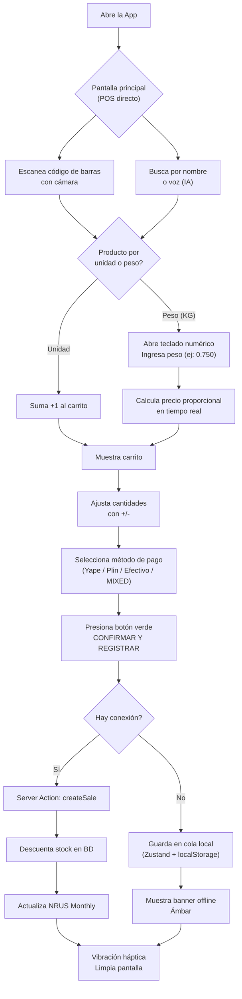
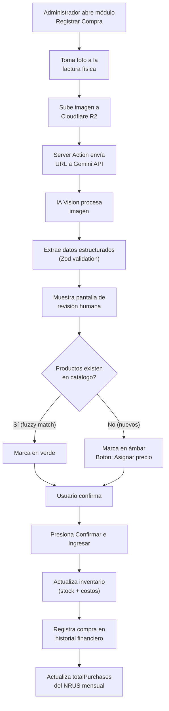
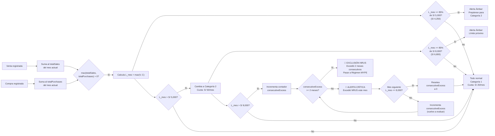
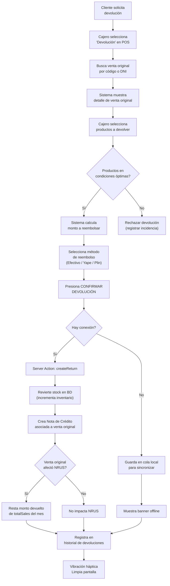
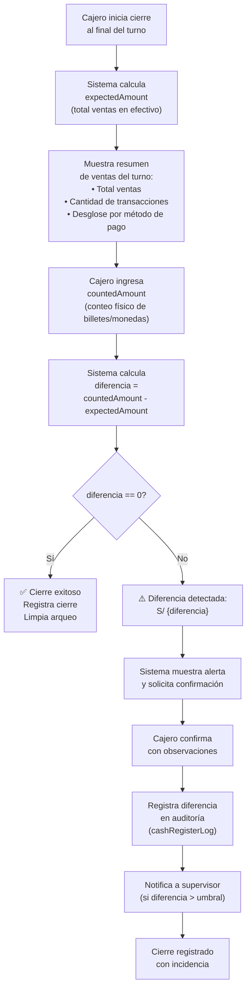
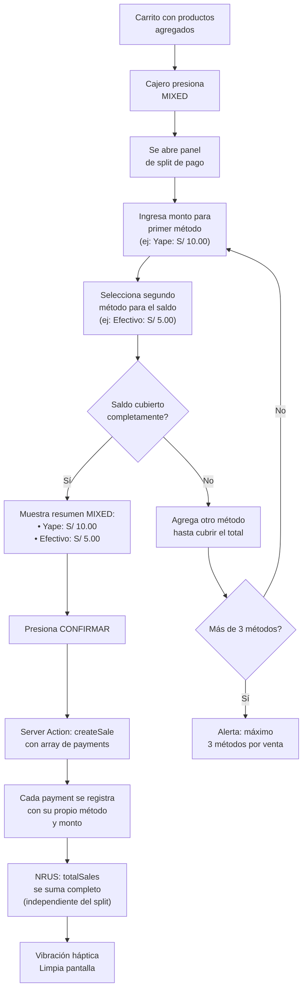

# Flujos UX — CajaRUS

## 1. Flujo de Venta Express (POS)



### Wireframe Conceptual — Pantalla POS

```
+-----------------------------------------------------+
| [≡] CajaRUS                     ( Carrito: S/ 0.00 )|
+-----------------------------------------------------+
|                                                     |
|  [ [O] ESCANEAR CÓDIGO (Cámara) ]   Botón Gigante   |
|                                                     |
+-----------------------------------------------------+
| [🔍 Buscar producto por nombre...               ]   |
| [🎙️] Botón Micrófono (IA Agéntica)                |
+-----------------------------------------------------+
| LISTA DEL CARRITO                                   |
|                                                     |
|  Leche Gloria Azul 400g                             |
|  [ - ]  2 und  [ + ]                  S/ 9.00  [X] |
|                                                     |
|  Arroz Costeño (Granel)                             |
|  [ Peso: 1.500 kg ]                   S/ 6.75  [X] |
+-----------------------------------------------------+
| TOTAL A COBRAR: S/ 15.75                            |
|                                                     |
|  [ YAPE ]  [ PLIN ]  [ EFECTIVO ]  [ MIXED ]       |
|  * MIXED: permite dividir pago en múltiples         |
|    métodos (ej: S/ 10 Yape + S/ 5 Efectivo)        |
|                                                     |
|  [ 🟢 CONFIRMAR Y REGISTRAR VENTA ]  Botón XXL     |
+-----------------------------------------------------+
```

## 2. Flujo de Compra con OCR (IA)



### Wireframe Conceptual — Pantalla OCR

```
+-----------------------------------------------------+
| [←] Registrar Compra Proveedor                      |
+-----------------------------------------------------+
|                                                     |
|  +-----------------------------------------------+  |
|  |                                               |  |
|  |           [ 📷 TOMAR FOTO A FACTURA ]         |  |
|  |                                               |  |
|  +-----------------------------------------------+  |
|                                                     |
+-----------------------------------------------------+
| DETECCIÓN EN PROCESO (Validación por IA)           |
|                                                     |
|  RUC: 20100058623 (Alicorp S.A.A.)                  |
|  Base Imponible: S/ 406.78                          |
|  IGV (18%):     S/  73.22                          |
|  Total Factura: S/ 480.00                           |
|                                                     |
|  Productos Detectados:                              |
|  • Aceite Primor 1L -- 20 und @ S/ 7.50             |
|  • Fideos Don Vittorio 500g -- 50 und @ S/ 3.20     |
|                                                     |
|  [⚠️ 2 productos nuevos no registrados]             |
+-----------------------------------------------------+
| [ 🔄 Volver a tomar ]    [ 💾 Confirmar e Ingresar ]|
+-----------------------------------------------------+
```

## 3. Flujo de Alertas NRUS (SUNAT)



## 4. Flujo de Devolución / Nota de Crédito



### Wireframe Conceptual — Devolución

```
+-----------------------------------------------------+
| [←] Devolución / Nota de Crédito                    |
+-----------------------------------------------------+
|                                                     |
|  🔍 Buscar venta original: [________________]      |
|                                                     |
|  Venta #1042 — 12/06/2026 — S/ 32.50                |
|  Cliente: María López                               |
|                                                     |
|  Productos originales:                              |
|  [✓] Leche Gloria 400g  x2     S/ 9.00             |
|  [✓] Arroz Costeño 1kg   x1     S/ 4.50             |
|  [ ] Fideos Don Vittorio x3     S/ 9.60             |
|                                                     |
+-----------------------------------------------------+
| Total a reembolsar: S/ 13.50                        |
|                                                     |
| Reembolsar vía: [ Efectivo ] [ Yape ] [ Plin ]     |
|                                                     |
|  [ 🔴 CONFIRMAR DEVOLUCIÓN Y NOTA DE CRÉDITO ]     |
+-----------------------------------------------------+
```

## 5. Flujo de Cierre de Caja



### Wireframe Conceptual — Cierre de Caja

```
+-----------------------------------------------------+
| [←] Cierre de Caja — Turno: Mañana                  |
+-----------------------------------------------------+
|  RESUMEN DEL TURNO                                  |
|  • Total ventas:              S/ 1,250.00           |
|  • Transacciones:             32                     |
|  • Efectivo:                  S/   850.00           |
|  • Yape:                      S/   250.00           |
|  • Plin:                      S/   100.00           |
|  • MIXED:                     S/    50.00           |
+-----------------------------------------------------+
|  ARQUEO DE EFECTIVO                                 |
|                                                     |
|  Expected (sistema):     S/   850.00                |
|  Counted (físico):       [ S/ ________ ]            |
|                                                     |
|  Diferencia:             S/     0.00                |
|                                                     |
+-----------------------------------------------------+
|                         [ 💾 CONFIRMAR CIERRE ]    |
+-----------------------------------------------------+
```

## 6. Flujo de Múltiples Métodos de Pago (MIXED)



### Wireframe Conceptual — Split MIXED

```
+-----------------------------------------------------+
| [←] Dividir pago — Total: S/ 15.75                  |
+-----------------------------------------------------+
|                                                     |
|  Monto pendiente: S/ 15.75                          |
|                                                     |
|  +-------------------------------------------------+|
|  | Método 1: [ Yape ▼ ]   Monto: [ S/ 10.00 ]    ||
|  | [✓] Pagado                                       ||
|  +-------------------------------------------------+|
|  +-------------------------------------------------+|
|  | Método 2: [ Efectivo ▼ ] Monto: [ S/  5.75 ]  ||
|  | [✓] Pagado                                       ||
|  +-------------------------------------------------+|
|                                                     |
|  [ + Agregar método ]  (máx. 3)                    |
|                                                     |
+-----------------------------------------------------+
|  Resumen: Yape S/10.00 + Efectivo S/5.75 = S/15.75 |
|                         [ 🟢 CONFIRMAR VENTA ]     |
+-----------------------------------------------------+
```
