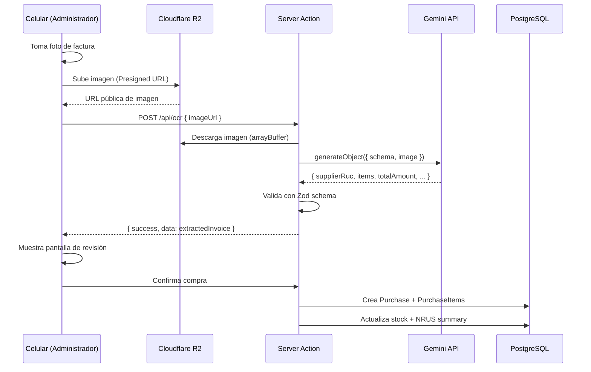

# Implementación del Agente de IA para OCR — CajaRUS

Procesamiento de facturas y boletas de proveedores peruanos (SUNAT) usando Vercel AI SDK + Google Gemini.

## Arquitectura del Procesamiento



## Esquema de Validación (Zod)

```typescript
import { z } from "zod";

export const invoiceOcrSchema = z.object({
  supplierRuc: z
    .string()
    .describe("RUC del proveedor. 11 dígitos numéricos."),
  supplierName: z
    .string()
    .describe("Razón social o nombre comercial del proveedor."),
  invoiceNumber: z
    .string()
    .describe("Serie y número: F001-00012345 o B120-23423."),
  purchaseDate: z
    .string()
    .describe("Fecha ISO: YYYY-MM-DD."),
  items: z.array(
    z.object({
      rawName: z
        .string()
        .describe("Nombre del producto tal cual en la factura."),
      quantity: z
        .number()
        .describe("Cantidad comprada. Permite decimales (ej. 12.500)."),
      unitCost: z
        .number()
        .describe("Costo unitario en Soles."),
      totalCost: z
        .number()
        .describe("Monto total del ítem (qty × unitCost)."),
    })
  ),
  totalAmount: z
    .number()
    .describe("Monto total final de la factura."),
});

export type InvoiceOcrResponse = z.infer<typeof invoiceOcrSchema>;
```

## System Prompt del Agente de Visión

```
ROL Y CONTEXTO:
Eres un asistente contable de alta precisión especializado en la legislación
tributaria de la SUNAT en el Perú. Tu tarea consiste en analizar la fotografía
de una factura o boleta de compra emitida por un proveedor mayorista.

INSTRUCCIONES CLAVE DE EXTRACCIÓN:
1. RUC del Proveedor (supplierRuc): Busca el número de RUC, siempre 11 dígitos
   que inician con "10" o "20". No confundas con el RUC de la tienda receptora.

2. Comprobante (invoiceNumber): Localiza la numeración del documento. Usualmente
   contiene una serie alfanumérica + guion + correlativo (ej. F001-001234).

3. Fecha de Emisión (purchaseDate): Convierte estrictamente a formato
   "YYYY-MM-DD" (ej: "15 de julio de 2026" → "2026-07-15").

4. Items: Lee cada línea de la tabla de compras:
   - rawName: descripción del producto omitiendo códigos internos largos
   - quantity: número con decimales si es peso o fracciones
   - unitCost / totalCost en Soles peruanos

5. Cuadre Matemático: Antes de retornar, valida que:
   Σ(totalCost_i) ≈ totalAmount
   Si hay variación de céntimos por IGV, prioriza el valor impreso.
```

## Endpoint API Route

```typescript
// app/api/ocr/route.ts
import { NextRequest, NextResponse } from "next/server";
import { google } from "@ai-sdk/google";
import { generateObject } from "ai";
import { invoiceOcrSchema } from "./schema";

export const runtime = "edge";

export async function POST(req: NextRequest) {
  try {
    const { imageUrl } = await req.json();

    if (!imageUrl) {
      return NextResponse.json(
        { error: "URL de imagen requerida." },
        { status: 400 }
      );
    }

    const imageResponse = await fetch(imageUrl);
    if (!imageResponse.ok) {
      throw new Error("No se pudo descargar la imagen desde R2.");
    }
    const imageBuffer = await imageResponse.arrayBuffer();
    const contentType = imageResponse.headers.get("content-type") || "image/jpeg";

    const { object: extractedInvoice } = await generateObject({
      model: google("gemini-1.5-flash"),
      schema: invoiceOcrSchema,
      messages: [
        {
          role: "user",
          content: [
            {
              type: "text",
              text: "Analiza el comprobante de pago peruano adjunto y extrae todos sus datos respetando las reglas de la SUNAT.",
            },
            {
              type: "image",
              image: imageBuffer,
              mimeType: contentType,
            },
          ],
        },
      ],
    });

    return NextResponse.json({
      success: true,
      data: extractedInvoice,
    });
  } catch (error: any) {
    console.error("Error en OCR:", error);
    return NextResponse.json(
      {
        success: false,
        error: error.message || "Error inesperado al procesar la factura.",
      },
      { status: 500 }
    );
  }
}
```

## Flujo de Integración en Cliente

1. El navegador genera una **Presigned URL** y sube la imagen directamente a **Cloudflare R2** (sin pasar por el servidor Next.js)
2. Una vez subida, el celular hace un `POST /api/ocr` con la URL de la imagen
3. El endpoint procesa con Gemini y retorna JSON estructurado
4. La app renderiza un **borrador editable** para validación humana
5. Al confirmar, se actualiza inventario y registro de compras en PostgreSQL
