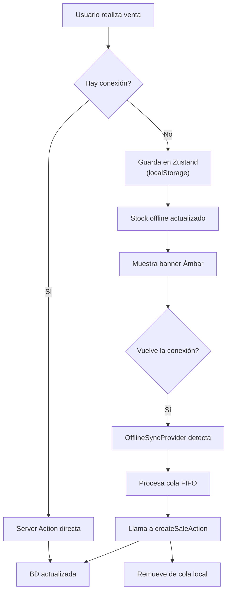

# PWA y Sincronización Offline — CajaRUS

Estrategia Offline-First para permitir ventas incluso con conexión inestable.

## 1. Manifest de la PWA

```json
{
  "theme_color": "#059669",
  "background_color": "#ffffff",
  "display": "standalone",
  "scope": "/",
  "start_url": "/pos",
  "name": "CajaRUS - El control de tu bodega al toque",
  "short_name": "CajaRUS",
  "description": "Punto de venta y control financiero inteligente para bodegas del Nuevo RUS en Perú.",
  "orientation": "portrait",
  "icons": [
    { "src": "/icons/icon-192x192.png", "sizes": "192x192", "type": "image/png" },
    { "src": "/icons/icon-512x512.png", "sizes": "512x512", "type": "image/png" },
    { "src": "/icons/icon-512x512-maskable.png", "sizes": "512x512", "type": "image/png", "purpose": "maskable" }
  ]
}
```

## 2. Configuración de Next.js

```typescript
// next.config.ts (ESM)
import type { NextConfig } from "next";

const nextConfig: NextConfig = {
  reactStrictMode: true,
};

export default nextConfig;
```

> **Nota:** El plugin PWA (`@ducanh2912/next-pwa`) está en dependencias pero desactivado temporalmente en `next.config.ts` por incompatibilidad con Turbopack (Next.js 16). Se reactivará cuando el plugin sea compatible o se migre a Webpack.

## 3. IndexedDB con Dexie.js

Para datos offline estructurados (catálogo de productos, ventas pendientes), se usa Dexie.js como capa de persistencia sobre IndexedDB, complementando Zustand para estado de UI volátil.

```typescript
// store/db.ts
import Dexie, { type EntityTable } from "dexie";

interface OfflineProduct {
  id: string;
  barcode: string | null;
  name: string;
  sellingPrice: number;
  unitType: "UNIT" | "KILOGRAM";
  stock: number;
  updatedAt: string;
}

interface PendingSale {
  id: string;
  cashierId: string;
  paymentMethod: string;
  items: { productId: string; quantity: number; unitPrice: number }[];
  totalAmount: number;
  saleDate: string;
  synced: boolean;
}

const db = new Dexie("CajaRUSOffline") as Dexie & {
  products: EntityTable<OfflineProduct, "id">;
  pendingSales: EntityTable<PendingSale, "id">;
};

db.version(1).stores({
  products: "&id, barcode, name, *updatedAt",
  pendingSales: "&id, synced, saleDate",
});

export type { OfflineProduct, PendingSale };
export { db };
```

## 4. Capas de Estado

| Capa | Tecnología | Propósito |
|---|---|---|
| UI efímera | Zustand (React state) | Carrito activo, modals, loading states |
| Persistencia offline estructurada | Dexie.js (IndexedDB) | Catálogo de productos, ventas pendientes |
| Sesión | Auth.js JWT | Autenticación (cookie httpOnly) |

### Zustand — Estado de UI

```typescript
// store/useCartStore.ts
import { create } from "zustand";

interface CartItem {
  productId: string;
  name: string;
  quantity: number;
  unitPrice: number;
}

interface CartState {
  items: CartItem[];
  addItem: (item: CartItem) => void;
  removeItem: (productId: string) => void;
  clearCart: () => void;
}

export const useCartStore = create<CartState>()((set) => ({
  items: [],
  addItem: (item) =>
    set((state) => {
      const existing = state.items.find((i) => i.productId === item.productId);
      if (existing) {
        return {
          items: state.items.map((i) =>
            i.productId === item.productId
              ? { ...i, quantity: i.quantity + item.quantity }
              : i
          ),
        };
      }
      return { items: [...state.items, item] };
    }),
  removeItem: (productId) =>
    set((state) => ({
      items: state.items.filter((i) => i.productId !== productId),
    })),
  clearCart: () => set({ items: [] }),
}));
```

## 5. Sincronizador Automático

```typescript
// components/OfflineSyncProvider.tsx
"use client";

import React, { useEffect } from "react";
import { useOfflineStore } from "@/store/useOfflineStore";
import { createSaleAction } from "@/actions/sales";

export default function OfflineSyncProvider({
  children,
}: {
  children: React.ReactNode;
}) {
  const { salesQueue, isOnline, setOnlineStatus, removeSaleFromQueue } =
    useOfflineStore();

  useEffect(() => {
    const handleOnline = () => setOnlineStatus(true);
    const handleOffline = () => setOnlineStatus(false);

    window.addEventListener("online", handleOnline);
    window.addEventListener("offline", handleOffline);

    return () => {
      window.removeEventListener("online", handleOnline);
      window.removeEventListener("offline", handleOffline);
    };
  }, [setOnlineStatus]);

  useEffect(() => {
    const syncOfflineSales = async () => {
      if (!isOnline || salesQueue.length === 0) return;

      for (const sale of salesQueue) {
        try {
          await createSaleAction({
            cashierId: sale.cashierId,
            paymentMethod: sale.paymentMethod,
            items: sale.items.map((item) => ({
              productId: item.productId,
              quantity: item.quantity,
            })),
          });
          removeSaleFromQueue(sale.id);
        } catch (error) {
          console.error(
            `[CajaRUS Sync] Error sincronizando venta ${sale.id}:`,
            error
          );
          break;
        }
      }
    };

    syncOfflineSales();
  }, [isOnline, salesQueue, removeSaleFromQueue]);

  return (
    <>
      {!isOnline && (
        <div className="bg-amber-600 text-white text-xs font-bold text-center py-2 sticky top-0 z-50 animate-pulse">
          Trabajando Sin Conexión (Los datos se guardarán localmente)
        </div>
      )}
      {children}
    </>
  );
}
```

## 6. Flujo Offline


