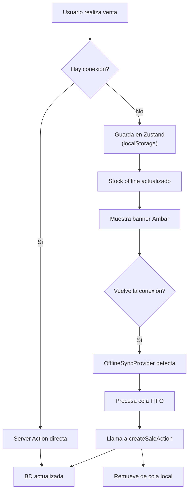

# PWA y Sincronización Offline — CajaRUS

Estrategia Offline-First para permitir ventas incluso con conexión inestable.

## 1. Manifest de la PWA

```json
{
  "theme_color": "#059669",
  "background_color": "#ffffff",
  "display": "standalone",
  "scope": "/",
  "start_url": "/pos",
  "name": "CajaRUS - El control de tu bodega al toque",
  "short_name": "CajaRUS",
  "description": "Punto de venta y control financiero inteligente para bodegas del Nuevo RUS en Perú.",
  "orientation": "portrait",
  "icons": [
    { "src": "/icons/icon-192x192.png", "sizes": "192x192", "type": "image/png" },
    { "src": "/icons/icon-512x512.png", "sizes": "512x512", "type": "image/png" },
    { "src": "/icons/icon-512x512-maskable.png", "sizes": "512x512", "type": "image/png", "purpose": "maskable" }
  ]
}
```

## 2. Configuración de Next.js

```javascript
// next.config.js
const withPWA = require("@ducanh2912/next-pwa").default({
  dest: "public",
  disable: process.env.NODE_ENV === "development",
  register: true,
  skipWaiting: true,
  cacheOnFrontEndNav: true,
  aggressiveFrontEndNavCaching: true,
  reloadOnOnline: true,
});

/** @type {import('next').NextConfig} */
const nextConfig = {
  reactStrictMode: true,
};

module.exports = withPWA(nextConfig);
```

## 3. Estado Local Offline con Zustand

```typescript
// store/useOfflineStore.ts
import { create } from "zustand";
import { persist, createJSONStorage } from "zustand/middleware";

export interface OfflineProduct {
  id: string;
  barcode: string | null;
  name: string;
  sellingPrice: number;
  unitType: "UNIT" | "KILOGRAM";
  stock: number;
}

export interface OfflineSaleItem {
  productId: string;
  quantity: number;
  unitPrice: number;
}

export interface OfflineSale {
  id: string;
  cashierId: string;
  paymentMethod: "CASH" | "YAPE" | "PLIN" | "CARD";
  items: OfflineSaleItem[];
  totalAmount: number;
  saleDate: string;
}

interface OfflineState {
  products: OfflineProduct[];
  salesQueue: OfflineSale[];
  isOnline: boolean;

  setProducts: (products: OfflineProduct[]) => void;
  updateProductStockLocal: (productId: string, quantityToSubtract: number) => void;
  addSaleToQueue: (sale: Omit<OfflineSale, "id" | "saleDate">) => void;
  clearQueue: () => void;
  removeSaleFromQueue: (saleId: string) => void;
  setOnlineStatus: (status: boolean) => void;
}

export const useOfflineStore = create<OfflineState>()(
  persist(
    (set, get) => ({
      products: [],
      salesQueue: [],
      isOnline: typeof window !== "undefined" ? navigator.onLine : true,

      setProducts: (products) => set({ products }),

      updateProductStockLocal: (productId, quantityToSubtract) => {
        const currentProducts = get().products;
        const updatedProducts = currentProducts.map((p) => {
          if (p.id === productId) {
            return { ...p, stock: Math.max(0, p.stock - quantityToSubtract) };
          }
          return p;
        });
        set({ products: updatedProducts });
      },

      addSaleToQueue: (saleData) => {
        const newSale: OfflineSale = {
          ...saleData,
          id: crypto.randomUUID(),
          saleDate: new Date().toISOString(),
        };
        set((state) => ({ salesQueue: [...state.salesQueue, newSale] }));
        saleData.items.forEach((item) => {
          get().updateProductStockLocal(item.productId, item.quantity);
        });
      },

      clearQueue: () => set({ salesQueue: [] }),

      removeSaleFromQueue: (saleId) =>
        set((state) => ({
          salesQueue: state.salesQueue.filter((s) => s.id !== saleId),
        })),

      setOnlineStatus: (status) => set({ isOnline: status }),
    }),
    {
      name: "cajarus-offline-storage",
      storage: createJSONStorage(() => localStorage),
    }
  )
);
```

## 4. Sincronizador Automático

```typescript
// components/OfflineSyncProvider.tsx
"use client";

import React, { useEffect } from "react";
import { useOfflineStore } from "@/store/useOfflineStore";
import { createSaleAction } from "@/actions/sales";

export default function OfflineSyncProvider({
  children,
}: {
  children: React.ReactNode;
}) {
  const { salesQueue, isOnline, setOnlineStatus, removeSaleFromQueue } =
    useOfflineStore();

  useEffect(() => {
    const handleOnline = () => setOnlineStatus(true);
    const handleOffline = () => setOnlineStatus(false);

    window.addEventListener("online", handleOnline);
    window.addEventListener("offline", handleOffline);

    return () => {
      window.removeEventListener("online", handleOnline);
      window.removeEventListener("offline", handleOffline);
    };
  }, [setOnlineStatus]);

  useEffect(() => {
    const syncOfflineSales = async () => {
      if (!isOnline || salesQueue.length === 0) return;

      for (const sale of salesQueue) {
        try {
          await createSaleAction({
            cashierId: sale.cashierId,
            paymentMethod: sale.paymentMethod,
            items: sale.items.map((item) => ({
              productId: item.productId,
              quantity: item.quantity,
            })),
          });
          removeSaleFromQueue(sale.id);
        } catch (error) {
          console.error(
            `[CajaRUS Sync] Error sincronizando venta ${sale.id}:`,
            error
          );
          break;
        }
      }
    };

    syncOfflineSales();
  }, [isOnline, salesQueue, removeSaleFromQueue]);

  return (
    <>
      {!isOnline && (
        <div className="bg-amber-600 text-white text-xs font-bold text-center py-2 sticky top-0 z-50 animate-pulse">
          Trabajando Sin Conexión (Los datos se guardarán localmente)
        </div>
      )}
      {children}
    </>
  );
}
```

## 5. Flujo Offline


