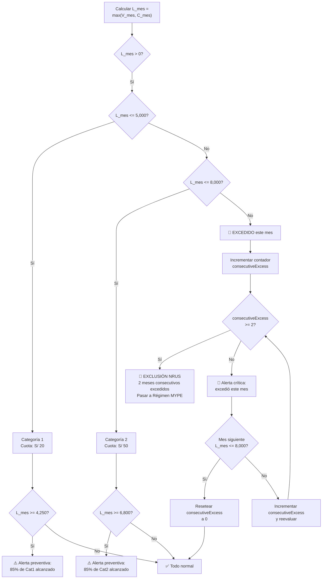

# Reglas del NRUS (Nuevo RUS) — CajaRUS

Lógica financiera para el control del régimen tributario simplificado de la SUNAT en Perú.

Fuente normativa: **Decreto Legislativo N° 1269, Nuevo Régimen Único Simplificado, modificado por D.L. 1529**.

## Categorías del NRUS

| Categoría | Límite Mensual (Ingresos o Compras) | Cuota Mensual SUNAT |
|---|---|---|
| Categoría 1 | Hasta S/ 5,000 | S/ 20 |
| Categoría 2 | Hasta S/ 8,000 | S/ 50 |
| EXCEDIDO | Más de S/ 8,000 | Régimen MYPE Tributario |

## Cálculo del Límite Operativo

$V_{mes} = \sum_{i=1}^{n} P_{sale\_item, i} \times Q_{sale\_item, i}$

$C_{mes} = \sum_{j=1}^{m} P_{purchase\_item, j} \times Q_{purchase\_item, j}$

$L_{mes} = \max(V_{mes}, C_{mes})$

Donde:
- $V_{mes}$ = Total consolidado de ventas del mes
- $C_{mes}$ = Total de compras del mes (con factura/boleta)
- $L_{mes}$ = Límite operativo mensual (el mayor de ambos)

### Nota sobre devoluciones

Si se realiza una **devolución** y la venta original se registró en el mismo mes, el `totalSales` debe **reducirse** en el monto devuelto. Si la venta original fue de un mes anterior, la devolución **no modifica** el NRUS de meses previos, pero se registra en el historial de ajustes.

## Determinación de Categoría

$$
\text{Categoría} =
\begin{cases}
1, & \text{si } L_{mes} \le 5000 \\
2, & \text{si } 5000 < L_{mes} \le 8000 \\
\text{EXCEDIDO}, & \text{si } L_{mes} > 8000
\end{cases}
$$

$$
\text{Cuota mensual (S/.)} =
\begin{cases}
20.00, & \text{si Categoría} = 1 \\
50.00, & \text{si Categoría} = 2 \\
\text{Régimen MYPE / Alerta Crítica}, & \text{si Categoría} = \text{EXCEDIDO}
\end{cases}
$$

## Umbrales de Alerta Preventiva

$U_{cat1} = 0.85 \times 5,000.00 = S/ 4,250.00$

$U_{cat2} = 0.85 \times 8,000.00 = S/ 6,800.00$

## Mapa de Decisiones



## Regla de Exclusión por 2 Meses Consecutivos

Si `L_mes` excede el límite de la categoría actual por **2 meses consecutivos**, el contribuyente es **excluido automáticamente** del NRUS y debe migrar al Régimen MYPE Tributario.

### Contador `consecutiveExcess`

El campo `consecutiveExcess` en `NrusMonthlySummary` lleva la cuenta de meses consecutivos en exceso:

- Se **incrementa en 1** cada mes que `L_mes > 8,000`
- Se **resetea a 0** si en un mes `L_mes <= 8,000`
- Si alcanza **2**, se dispara la exclusión automática

```
Mes 1: L_mes = 9,000 → consecutiveExcess = 1 → Alerta crítica
Mes 2: L_mes = 8,500 → consecutiveExcess = 2 → EXCLUSIÓN NRUS
Mes 3: Ya no aplica NRUS, pasa a Régimen MYPE
```

```
Mes 1: L_mes = 9,000 → consecutiveExcess = 1 → Alerta crítica
Mes 2: L_mes = 7,500 → consecutiveExcess = 0 → Resetea (no hay exclusión)
```

## Modelo NrusPayment (Pagos Mensuales)

Reemplaza el campo booleano `taxPaid` con una entidad aparte que registra el historial de pagos.

```typescript
enum NrusPaymentStatus {
  PENDING,      // Pendiente de pago
  PAID_ON_TIME, // Pagado dentro del plazo (primeros 5 días hábiles)
  PAID_LATE,    // Pagado después del plazo (con mora)
  OVERDUE,      // En mora (no pagado después del plazo)
}

model NrusMonthlySummary {
  id                String   @id @default(cuid())
  year              Int
  month             Int
  totalSales        Decimal  @default(0)
  totalPurchases    Decimal  @default(0)
  currentCategory   Int      @default(1)
  consecutiveExcess Int      @default(0)

  payments          NrusPayment[]

  @@unique([year, month])
  @@map("nrus_monthly_summaries")
}

model NrusPayment {
  id               String           @id @default(cuid())
  nrusSummaryId    String
  nrusSummary      NrusMonthlySummary @relation(fields: [nrusSummaryId], references: [id])
  amount           Decimal          // S/ 20 o S/ 50
  status           NrusPaymentStatus @default(PENDING)
  dueDate          DateTime         // Primeros 5 días hábiles del mes siguiente
  paidAt           DateTime?
  lateFee          Decimal?         // Mora calculada si aplica

  @@map("nrus_payments")
}
```

### Cálculo de Mora

Si el pago se realiza después de los primeros 5 días hábiles del mes siguiente, se aplica una mora del **0.04% diario** sobre la cuota impaga (tasa referencial SUNAT, sujeta a actualización).

### Recordatorio

El sistema debe enviar una notificación **5 días antes del vencimiento** (es decir, 5 días antes del inicio del mes siguiente) recordando al usuario que debe pagar su cuota NRUS.

## Restricción: No Emisión de Facturas

En el régimen NRUS **no se pueden emitir facturas**. Solo se emiten **boletas de venta** (comprobantes que no permiten crédito fiscal al comprador).

- Si un cliente solicita una **factura**, la app debe **alertar** al usuario indicando que no es posible emitir facturas bajo NRUS.
- El sistema debe ofrecer como alternativa: emitir una boleta electrónica (Boleta de Venta Electrónica) o sugerir al cliente contactar a un proveedor que sí emita facturas bajo Régimen MYPE o General.

## Gastos Operativos (Opcionales)

Los gastos operativos del negocio (alquiler, servicios, sueldos, etc.) **no afectan** el cálculo del NRUS, ya que el NRUS se determina únicamente por ingresos brutos o compras brutas (el mayor de ambos).

Sin embargo, la app puede **opcionalmente** registrar gastos operativos para:

1. Calcular la **rentabilidad real** del negocio
2. Generar reportes financieros para el dueño
3. Tener trazabilidad en caso de migrar a Régimen MYPE (donde los gastos sí afectan la base imponible)

Los gastos operativos se almacenan en una tabla separada `OperationalExpense` y no participan en las reglas NRUS.

## Implementación en Server Action

```typescript
// Lógica de actualización del NRUS después de cada venta
const now = new Date();
const summary = await prisma.nrusMonthlySummary.upsert({
  where: {
    year_month: {
      year: now.getFullYear(),
      month: now.getMonth() + 1,
    },
  },
  update: {
    totalSales: { increment: total },
    currentCategory: /* calcular según nuevo total */,
  },
  create: {
    year: now.getFullYear(),
    month: now.getMonth() + 1,
    totalSales: total,
    totalPurchases: 0,
    currentCategory: 1,
    consecutiveExcess: 0,
  },
});

// Evaluar consecutiveExcess después de actualizar
if (summary.currentCategory === 2 && L_mes > 8000) {
  // L_mes excede el límite
  await prisma.nrusMonthlySummary.update({
    where: { id: summary.id },
    data: { consecutiveExcess: { increment: 1 } },
  });

  // Verificar si llega a 2 → exclusión automática
  if (summary.consecutiveExcess + 1 >= 2) {
    // Disparar alerta de exclusión NRUS
    await triggerExclusionAlert(summary.id);
  }
} else {
  // Resetear si no excede
  await prisma.nrusMonthlySummary.update({
    where: { id: summary.id },
    data: { consecutiveExcess: 0 },
  });
}
```

## Reglas de Negocio

1. **Límite es el máximo** entre ingresos y compras del mes ($L_{mes} = \max(V_{mes}, C_{mes})$)
2. **Alerta al 85%** de cada categoría para prevenir excedentes
3. **Alerta crítica** si $L_{mes} > 8,000$: obliga a migrar al Régimen MYPE Tributario
4. **Exclusión por 2 meses consecutivos**: si `consecutiveExcess >= 2`, exclusión automática del NRUS
5. **Resumen mensual persistido** en `NrusMonthlySummary` para evitar recálculos costosos
6. El campo `consecutiveExcess` se resetea a 0 si un mes no excede el límite
7. **No se emiten facturas** en NRUS, solo boletas
8. Las **devoluciones** reducen `totalSales` del mes si la venta original fue en el mismo período
9. Los **gastos operativos** son opcionales y no afectan el NRUS
